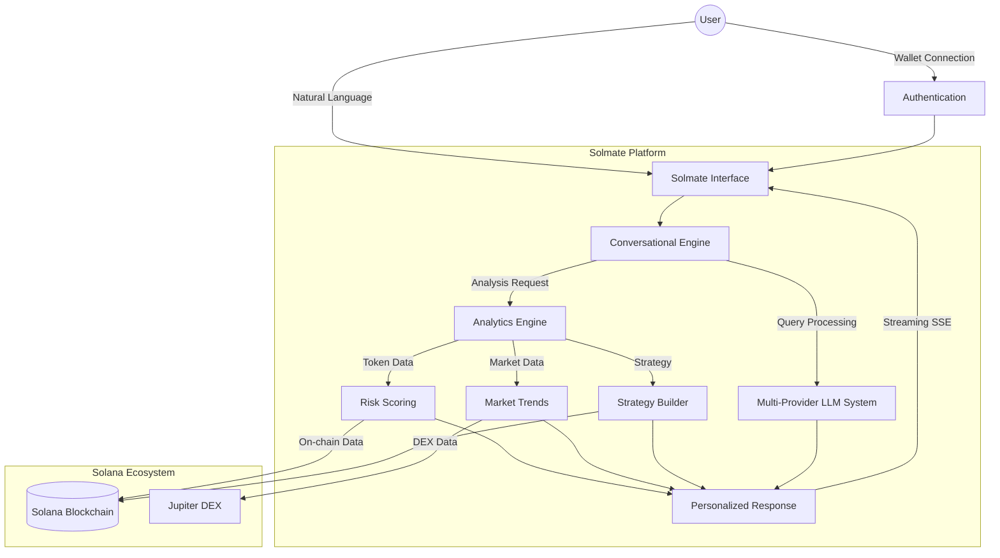
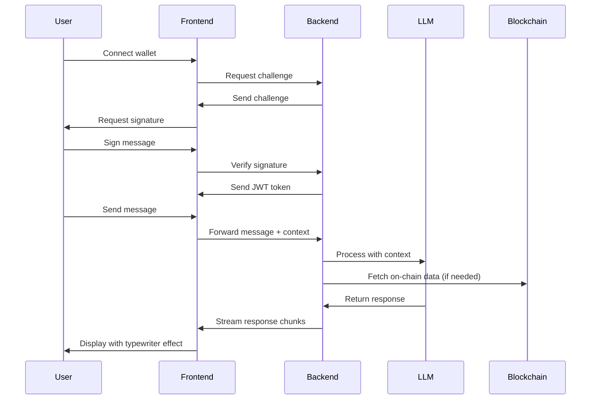
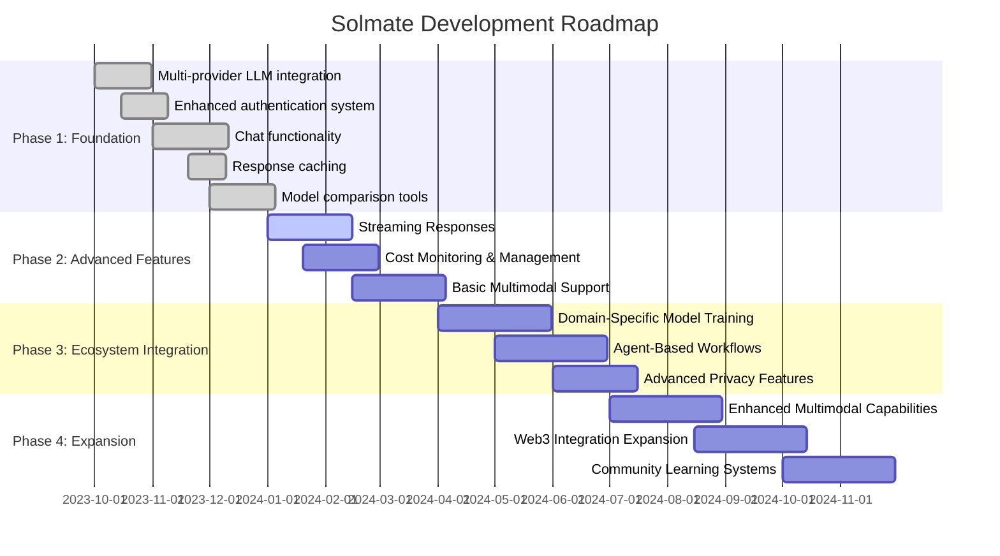

# Solmate: AI-Powered Trading Assistant for Solana

<div align="center">
  
  
  [](https://opensource.org/licenses/MIT)
  [](https://sol-mate.online)
  [](https://github.com/SolMate-tech/SolMate)
  [](https://x.com/SolMate_AI_)
</div>

## 📋 Project Overview

Solmate is an advanced AI-powered trading assistant designed specifically for the Solana ecosystem. It combines natural language processing with deep blockchain analytics to provide users with conversational access to trading strategies, risk analysis, and educational content.

Key differentiation points:
- **Truly conversational interface** without command structures or prefixes
- **Multi-provider LLM integration** with secure API key management
- **Solana-specific analytics** with comprehensive risk scoring
- **Wallet authentication** with blockchain verification
- **Real-time streaming responses** with typewriter effect UI

<div align="center">



</div>

## 🛠️ Tech Stack

### Frontend
- **React.js** - UI framework
- **Context API** - State management
- **CSS Modules** - Styling
- **SSE (Server-Sent Events)** - Real-time streaming
- **Wallet Adapter** - Solana wallet integration

### Backend
- **Node.js** - Runtime environment
- **Express** - Web framework
- **MongoDB** - Database
- **JWT** - Authentication
- **LLM Integration** - Multi-provider API structure

### Blockchain
- **Solana Web3.js** - Blockchain interaction
- **Anchor** - Smart contract framework
- **Jupiter SDK** - DEX aggregation

## 🏗️ Architecture

Solmate follows a modular architecture with clear separation of concerns:

```mermaid
graph TD
    subgraph "Frontend"
        UI[User Interface]
        Context[Context Providers]
        Hooks[Custom Hooks]
        Services[API Services]
    end
    
    subgraph "Backend"
        API[API Routes]
        Controllers[Controllers]
        Middleware[Middleware]
        Models[Data Models]
        Services[Business Logic]
    end
    
    subgraph "External Services"
        LLM[LLM Providers]
        Blockchain[Solana Blockchain]
        Data[Market Data APIs]
    end
    
    UI --> Context
    Context --> Hooks
    Hooks --> Services
    Services --> API
    API --> Controllers
    Controllers --> Services
    Services --> Models
    Services --> External Services
    Middleware --> API
```

### System Components

1. **Authentication Layer**
   - Wallet-based authentication
   - JWT token management
   - Session tracking

2. **Conversational Engine**
   - Multi-provider LLM integration (OpenAI, Anthropic, etc.)
   - Context management
   - Response streaming

3. **Analytics Framework**
   - Risk scoring system
   - Token metrics analysis
   - Market trend evaluation

4. **User Experience Layer**
   - Real-time UI updates
   - Responsive design
   - Progressive UI loading

## 📊 Data Flow

The following diagram illustrates how data flows through the Solmate system:



### API Routes Structure

```
/api
├── auth
│   ├── verify-wallet     # Wallet signature verification
│   └── user              # User profile management
├── chat
│   ├── message           # Send messages to AI
│   ├── history           # Get conversation history
│   └── llm-providers     # Manage LLM provider settings
└── analytics
    ├── risk-analysis     # Token risk assessment
    └── token-metrics     # On-chain token data
```

## 💻 Key Code Features

### 1. Streaming Chat Interface

The streaming chat interface enables real-time message delivery with a typewriter effect:

```javascript
// StreamingChatMessage.js
const StreamingChatMessage = ({ message, stream }) => {
  const [displayedContent, setDisplayedContent] = useState('');
  const [isComplete, setIsComplete] = useState(!stream);
  
  useEffect(() => {
    if (!stream) {
      setDisplayedContent(message);
      setIsComplete(true);
      return;
    }
    
    let content = '';
    const eventSource = new EventSource(`/api/chat/stream/${message.id}`);
    
    eventSource.onmessage = (event) => {
      const chunk = JSON.parse(event.data);
      content += chunk.content;
      setDisplayedContent(content);
    };
    
    eventSource.addEventListener('complete', () => {
      setIsComplete(true);
      eventSource.close();
    });
    
    return () => eventSource.close();
  }, [message, stream]);
  
  // Rendering logic...
}
```

### 2. Multi-Provider LLM Integration

The LLM provider system allows users to select different AI models:

```javascript
// backend/src/services/responseManagerService.js
const processMessage = async (message, context, options) => {
  const { provider = defaultProvider, model = defaultModel } = options;
  
  // Select provider implementation
  const providerService = llmProviders[provider] || llmProviders[defaultProvider];
  
  // Check cache for identical queries
  const cacheKey = generateCacheKey(message, context, provider, model);
  const cachedResponse = await cache.get(cacheKey);
  
  if (cachedResponse) {
    return {
      ...cachedResponse,
      fromCache: true
    };
  }
  
  // Process with selected provider
  const response = await providerService.generateResponse(message, context, model);
  
  // Cache the response
  await cache.set(cacheKey, response, config.CACHE_TTL);
  
  return response;
};
```

### 3. Wallet Authentication

Solana wallet authentication provides secure and seamless login:

```javascript
// frontend/src/contexts/WalletContext.js
const signIn = async () => {
  try {
    setAuthenticating(true);
    
    // Request challenge message from server
    const { challenge } = await authService.getChallenge();
    
    // Request user to sign message with wallet
    const signature = await wallet.signMessage(
      new TextEncoder().encode(challenge)
    );
    
    // Verify signature on server
    const { token, user } = await authService.verifyWallet({
      publicKey: wallet.publicKey.toString(),
      signature: bs58.encode(signature),
      message: challenge
    });
    
    // Store authentication data
    localStorage.setItem('token', token);
    setUser(user);
    setAuthenticated(true);
    
  } catch (error) {
    console.error('Authentication error:', error);
    setAuthError(error.message);
  } finally {
    setAuthenticating(false);
  }
};
```

## 🚀 Development Roadmap

Solmate is being developed in four major phases:



### Current Status 

Solmate is currently transitioning from Phase 1 (Foundation) to Phase 2 (Advanced Features). We have completed:

✅ Multi-provider LLM integration with secure API key management  
✅ Enhanced authentication system with wallet verification  
✅ Chat functionality with history management  
✅ Response caching for improved performance  
✅ Model comparison tools for developers  

We are now working on:
🔄 Implementing real-time streaming for AI responses  
🔄 Building cost monitoring and management systems  
🔄 Developing basic multimodal support  

## 📦 Project Structure

```
solmate/
├── frontend/               # React frontend application
│   ├── src/
│   │   ├── components/     # Reusable UI components
│   │   ├── contexts/       # React context providers
│   │   ├── hooks/          # Custom React hooks
│   │   ├── pages/          # Page components
│   │   ├── services/       # API services
│   │   └── utils/          # Utility functions
├── backend/                # Node.js backend server
│   ├── src/
│   │   ├── config/         # Configuration files
│   │   ├── controllers/    # Route controllers
│   │   ├── middlewares/    # Express middlewares
│   │   ├── models/         # Mongoose models
│   │   ├── routes/         # API routes
│   │   ├── services/       # Business logic
│   │   └── utils/          # Utility functions
├── contracts/              # Solana smart contracts
├── shared/                 # Shared code
├── scripts/                # Utility scripts
└── docs/                   # Documentation
```

## 🚀 Getting Started

### Prerequisites

- Node.js (v16+)
- npm (v8+)
- Solana CLI (v1.16+)
- Anchor Framework (v0.27+)
- A Solana wallet (Phantom, Solflare, etc.)

### Installation

```bash
# Clone the repository
git clone https://github.com/SolMate-tech/SolMate.git
cd SolMate

# Install dependencies
npm install

# Configure environment
cp .env.example .env
# Edit .env with your configuration

# Start the development services
npm start
```

## 📄 Documentation

- [API Documentation](docs/API.md)
- [Development Guide](docs/DEVELOPMENT.md)
- [Deployment Guide](docs/DEPLOYMENT.md)

## 🤝 Contributing

We welcome contributions from the community! Please see our [Contributing Guidelines](CONTRIBUTING.md) for more information.

## 🔒 Security

For security concerns, please refer to our [Security Policy](SECURITY.md).

## 📜 License

This project is licensed under the MIT License - see the [LICENSE](LICENSE) file for details.

## 📞 Contact

- Website: [sol-mate.online](https://sol-mate.online)
- Twitter: [SolMate_AI_](https://x.com/SolMate_AI_)
- GitHub: [SolMate-tech/SolMate](https://github.com/SolMate-tech/SolMate)
